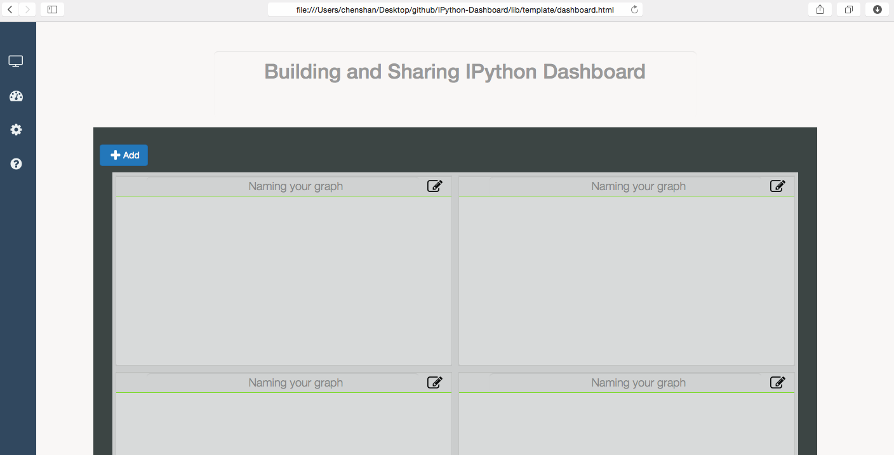

# IPython-Dashboard
An stand alone, light-weight web server for building, sharing graphs in created in ipython. Let ipython do what it focus, let this do what everyone needs for building a interactive, collaborated and real-time streaming dashboards.

# Goal 

- support raw html visualization
- support python object visualization
- Editable 
- Real-time fresh when rendering a variable python object
- Can be shared, both public and private [ need password ]
- In the notebook, can share an object to a dashboard [ that's visualise that object in that dashboard ]

# Raw Design

- C/S model 
- Server can interact with IPython kernel directly or indirectly 
- Client get data from server internally or server push data to client
- Client consists of several boxes, each box is an independent front-side object, and is editable and drag to rearrange the place to hold it.

# Change Log

- V 0.1
    + Add dashboard client template
    + Template consists of box, each box is an independent front-side object
    + Template hierarchy:
        + box page [add, delete, share one or all]
        + box graph [add, delete, share one or all]
        + rename

# To do

- edit box in a mask
- hover tips
- clean up code before merging to master

# Related Projects

- [mpld3](https://github.com/jakevdp/mpld3)
- [lighting](http://lightning-viz.org/)
- [bokeh](http://bokeh.pydata.org/en/latest/)
- [matplotlib](http://matplotlib.org)
- [zeppelin](https://github.com/apache/incubator-zeppelin)
- [yhat](https://github.com/yhat/rodeo)
- [hue](https://github.com/cloudera/hue)
- [plotly](https://github.com/plotly/dashboards)

