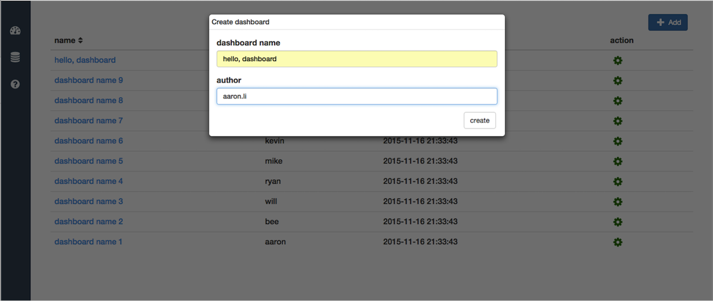
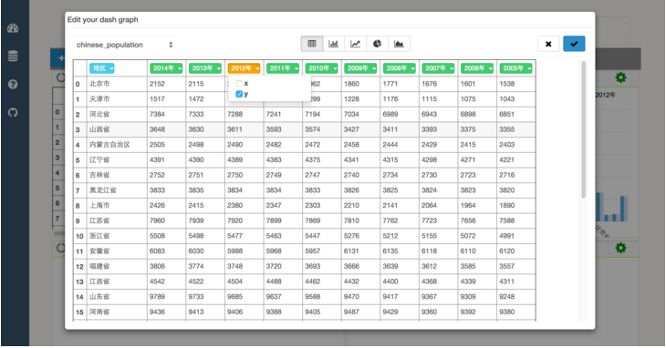
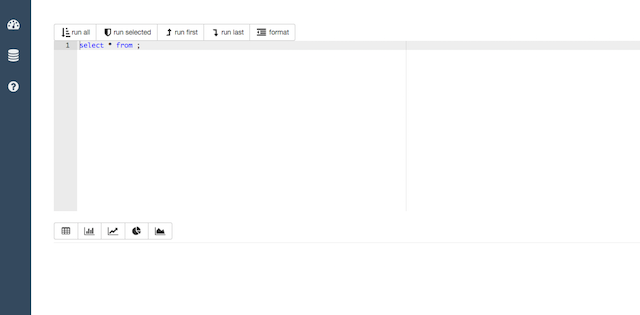

[](https://travis-ci.org/litaotao/IPython-Dashboard) [](http://ipython-dashboard.readthedocs.org/en/latest)   [](https://coveralls.io/r/litaotao/IPython-Dashboard)   [](https://pypi.python.org/pypi/IPython-Dashboard)  [](https://pypi.python.org/pypi/IPython-Dashboard)


## ***Inspired by [IPython](http://ipython.org/), built with love***


# IPython-Dashboard
A stand alone, light-weight web server for building, sharing graphs created in IPython. Build for data science, data analysis guys. Aiming at building an interactive visualization, collaborated dashboard, and real-time streaming graph.


# Usage

- *Install prerequisite*
    + install the latest stable IPython-Dashboard: `pip install ipython-dashboard --upgrade`
    + install redis 2.6+ : [install guide](http://redis.io/topics/quickstart)
    + install IPython-Dashboard requirements [unneeded sometimes]:
        - `cd ~/your python package path/IPython-Dashboard`
        - `pip install -r requirements.txt`


- *Config IPython-Dashboard server : `IPython-Dashboard/dashboard/config.py`*
    + `app_host='ip_address:port'`


- *Start redis and IPython-Dashboard server*

```
chenshan@mac007:~/Desktop/github/IPython-Dashboard$redis-server &

chenshan@mac007:~/Desktop/github/IPython-Dashboard$dash-server --help
usage: dash-server [-h] [-H HOST] [-p PORT] [-d DEBUG]

Start your IPython-Dashboard server ...

optional arguments:
  -h, --help            show this help message and exit
  -H HOST, --host HOST  server host, default localhost
  -p PORT, --port PORT  server port, default 9090
  -d DEBUG, --debug DEBUG
                        server port, default true

chenshan@mac007:~/Desktop/github/IPython-Dashboard$dash-server
Namespace(debug=True, host='0.0.0.0', port=9090)
 * Running on http://0.0.0.0:9090/
 * Restarting with reloader
Namespace(debug=True, host='0.0.0.0', port=9090)
```

- *Do your exploring*
    + ***IPython-Dashboard-Tutorial.ipynb*** : [On nbviewer](http://nbviewer.ipython.org/github/litaotao/IPython-Dashboard/blob/master/docs/IPython-Dashboard-Tutorial.ipynb) or [On github](https://github.com/litaotao/IPython-Dashboard/blob/master/docs/IPython-Dashboard-Tutorial.ipynb)


# Goal

- support raw html visualization
- support python object visualization
- Editable
- Real-time fresh when rendering a variable python object
- Can be shared, both public and private [ need password ]
- In the notebook, can share an object to a dashboard [ that's visualize that object in that dashboard ]

# Use Case

- exploring in notebook, share/send the result/summary to people, without the details.
- share some data in a private notebook.
- disappointed with the complicated code when drawing a graceful/staic graph using matplotlib/seaborn/mpld3 etc.
- want an interactive graph, allow people to zoom in/out, resize, get hover tips, change graph type easily.
- want a real-time graph.
- want an collaborated graph/dashboard.


# Screenshot and Demo

[Demo on Youtube](https://youtu.be/LOWBEYDkn90)     
[Demo on Youku](http://v.youku.com/v_show/id_XMTM3MTc5MTAwMA)









# Run tests

just run `sudo nosetests --with-coverage --cover-package=dashboard` under this repo

```
aaron@aarons-MacBook-Pro:~/Desktop/github/IPython-Dashboard$sudo nosetests --with-coverage --cover-package=dahboard
....
Name                                    Stmts   Miss  Cover   Missing
---------------------------------------------------------------------
dashboard.py                               11      0   100%
dashboard/client.py                         1      0   100%
dashboard/client/sender.py                 11      3    73%   26-27, 33
dashboard/config.py                        11      0   100%
dashboard/server.py                         1      0   100%
dashboard/server/resources.py               0      0   100%
dashboard/server/resources/dash.py         35     10    71%   55-56, 67-69, 82-89
dashboard/server/resources/home.py         40     12    70%   25, 28-30, 83-91
dashboard/server/resources/status.py        8      1    88%   19
dashboard/server/resources/storage.py      15      5    67%   28, 43-47
dashboard/server/utils.py                  31      6    81%   18-22, 29, 43
dashboard/server/views.py                  12      0   100%
---------------------------------------------------------------------
TOTAL                                     176     37    79%
----------------------------------------------------------------------
Ran 4 tests in 3.120s

OK
```


# [Change Log](./CHANGES.md)

- future
    + front side, databricks style
    + pep 8, code clean up & restructure
    + hover tips
    + edit modal can be resized
    + Share one graph
    + Share one dashboard
    + Presentation mode
    + footer
    + unified message display center
    + SQL Editor
    + login management
    + unified logger and exception report
    + server side log
    + client side log
    + support python3
    + create examples


- ***V 0.1.5 : sql-server-log [ current develop version ]***

    - Dashboard
        + create 1 example
        + server side log
        + support x-axis as date format
        + research on real-time updated dataframe

    - SQL Editor
        + sql server develop : render sql result as table view


- ***V 0.1.4 : sql-ui-optimize : [ current stable release ]***

    - Dashboard
        + create 1 example
        + hover tips
        + unified message display
        + make the redis-server/dash-server configurable

    - SQL Editor
        + sql editor web UI.

# Related Projects & Products

- [mpld3](https://github.com/jakevdp/mpld3)
- [lighting](http://lightning-viz.org/)
- [bokeh](http://bokeh.pydata.org/en/latest/)
- [matplotlib](http://matplotlib.org)
- [zeppelin](https://github.com/apache/incubator-zeppelin)
- [yhat](https://github.com/yhat/rodeo)
- [hue](https://github.com/cloudera/hue)
- [plotly](https://github.com/plotly/dashboards)
- [datadog](https://www.datadoghq.com)
- [databricks](https://databricks.com/)
- [nvd3](http://nvd3.org/)
- [c3js](http://c3js.org/)
- [periscope](http://periscope.io)
- [folium](https://github.com/python-visualization/folium)
- [metabase](http://www.metabase.com/)
- [gridstack](https://github.com/troolee/gridstack.js)
- [gridster](http://gridster.net/)
- [dashboards](https://github.com/jupyter-incubator/dashboards)
- [js, css, html code style](https://github.com/fex-team/styleguide)
