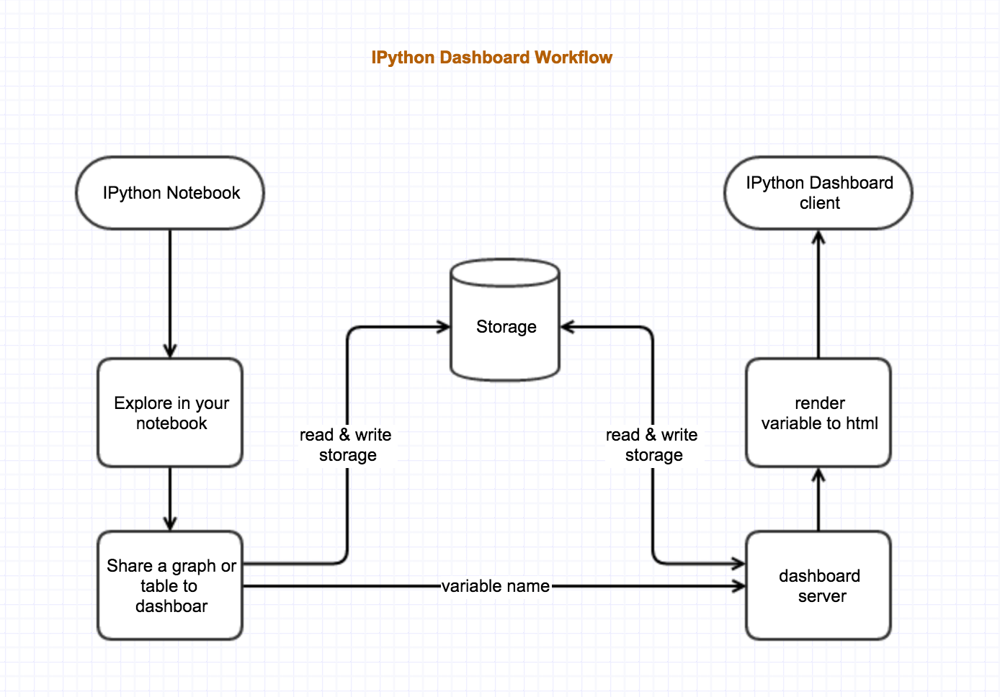
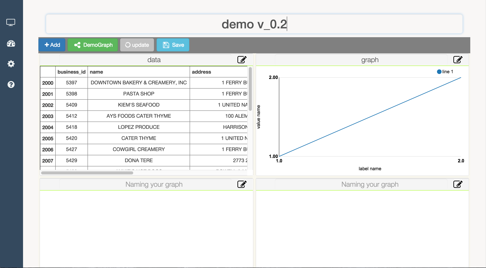
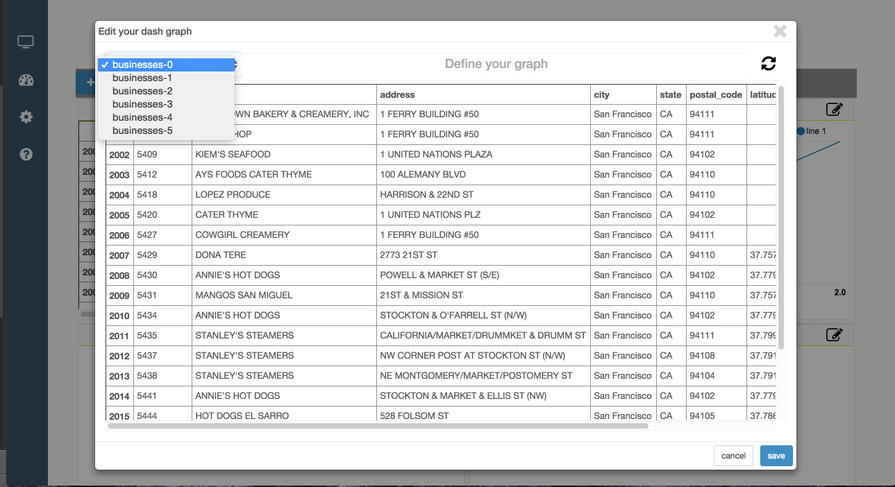

-----

[](https://travis-ci.org/litaotao/IPython-Dashboard)

-----

# IPython-Dashboard
A stand alone, light-weight web server for building, sharing graphs in created in ipython. Let ipython do what it focus, let this do what everyone needs for building an interactive, collaborated and real-time streaming dashboards.


# Goal 

- support raw html visualization
- support python object visualization
- Editable 
- Real-time fresh when rendering a variable python object
- Can be shared, both public and private [ need password ]
- In the notebook, can share an object to a dashboard [ that's visualise that object in that dashboard ]


# Raw Design

- C/S model 
- Server can interact with IPython kernel directly or indirectly 
- Client get data from server internally or server push data to client
- Client consists of several boxes, each box is an independent front-side object, and is editable and drag to rearrange the place to hold it.





# Screenshot & [Demo](https://youtu.be/jFQdHdzDoF4)

[](https://youtu.be/jFQdHdzDoF4)
[](https://youtu.be/jFQdHdzDoF4)


# Run tests

just run `nosetests` under this repo

```
aaron@aarons-MacBook-Pro:~/Desktop/github/IPython-Dashboard$nosetests
.
----------------------------------------------------------------------
Ran 1 test in 7.798s

OK
```


# Related Projects & Products 

- [mpld3](https://github.com/jakevdp/mpld3)
- [lighting](http://lightning-viz.org/)
- [bokeh](http://bokeh.pydata.org/en/latest/)
- [matplotlib](http://matplotlib.org)
- [zeppelin](https://github.com/apache/incubator-zeppelin)
- [yhat](https://github.com/yhat/rodeo)
- [hue](https://github.com/cloudera/hue)
- [plotly](https://github.com/plotly/dashboards)
- [datadog](https://www.datadoghq.com)
- [databricks](https://databricks.com/)
- [nvd3](http://nvd3.org/)
- [c3js](http://c3js.org/)


# Change Log


- V 0.2.2
    + front side, databricks style
    + pep 8, code clean up & restructure
    + hover tips
    + edit modal can be resized


- V 0.2.1
    + Share one graph
    + Share one dashboard
    + Presentation mode
    + slogan
    + footer
    + readthedoc


- V 0.2
    + Interact with server [ CURD ]
    + Simple visualization
    + Rearrange buttons [ add, share ]
    + Dash json format
        - dash number [list]
        - content name
        - content type
    + docstring


- V 0.1
    + Add dashboard client template
    + Template consists of box, each box is an independent front-side object
    + Template hierarchy:
        + box page [add, delete, share one or all]
        + box graph [add, delete, share one or all]
        + rename


