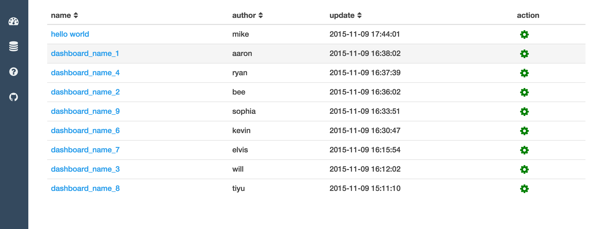
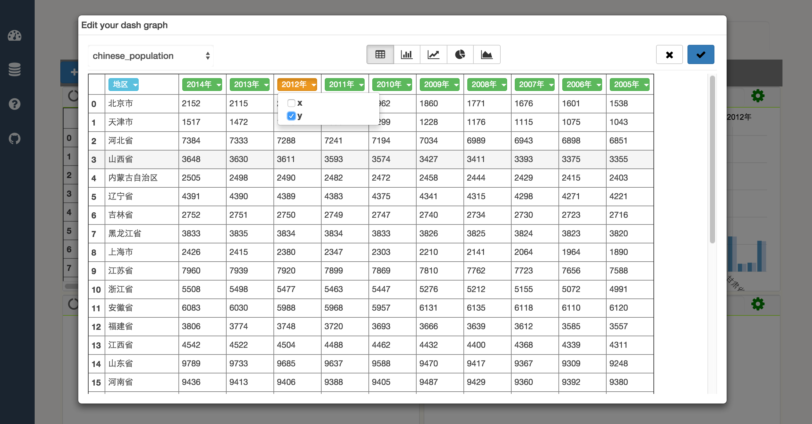
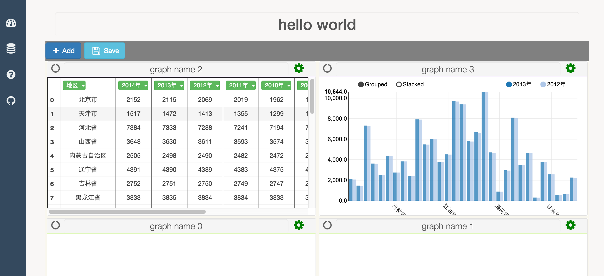

--------------

|build status| |coverage| |Documentation Status| |PyPI Version|

--------------

***Inspired by `IPython <http://ipython.org/>`__, built with love***
====================================================================

--------------

IPython-Dashboard
=================

A stand alone, light-weight web server for building, sharing graphs
created in ipython. Build for data science, data analysis guys. Building
an interactive visualization, collaborated dashboard, and real-time
streaming graph.

--------------

Goal
====

-  support raw html visualization
-  support python object visualization
-  Editable
-  Real-time fresh when rendering a variable python object
-  Can be shared, both public and private [ need password ]
-  In the notebook, can share an object to a dashboard [ that's
   visualize that object in that dashboard ]

--------------

Screenshot and Demo
===================

| `Demo on Youtube <https://youtu.be/LOWBEYDkn90>`__
| `Demo on Youku <http://v.youku.com/v_show/id_XMTM3MTc5MTAwMA>`__

   demo

   demo

   demo

--------------

Usage
=====

***IPython-Dashboard-Tutorial.ipynb***: `On
nbviewer <http://nbviewer.ipython.org/github/litaotao/IPython-Dashboard/blob/v-0.1.2-visualiza-table/docs/IPython-Dashboard-Tutorial.ipynb>`__
or `On
github <https://github.com/litaotao/IPython-Dashboard/blob/v-0.1.2-visualiza-table/docs/IPython-Dashboard-Tutorial.ipynb>`__

--------------

Run tests
=========

just run ``sudo nosetests --with-coverage --cover-package=dashboard``
under this repo

::

    aaron@aarons-MacBook-Pro:~/Desktop/github/IPython-Dashboard$sudo nosetests --with-coverage --cover-package=dashboard
    ...
    Name                                    Stmts   Miss  Cover   Missing
    ---------------------------------------------------------------------
    dashboard.py                                9      0   100%
    dashboard/client.py                         1      0   100%
    dashboard/client/sender.py                 11      9    18%   22-34
    dashboard/config.py                        12      0   100%
    dashboard/server.py                         1      0   100%
    dashboard/server/resources.py               0      0   100%
    dashboard/server/resources/dash.py         41     25    39%   25-30, 39, 48-49, 55-71, 76-87
    dashboard/server/resources/home.py          8      1    88%   20
    dashboard/server/resources/storage.py      15      7    53%   20-22, 30-34
    dashboard/server/utils.py                  31      6    81%   18-22, 29, 43
    dashboard/server/views.py                  12      0   100%
    ---------------------------------------------------------------------
    TOTAL                                     141     48    66%
    ----------------------------------------------------------------------
    Ran 3 tests in 0.345s

    OK

--------------

Change Log
==========

-  future

   -  import dashboard to ipython notebook, one click [ though I don't
      think it's necessary]
   -  front side, databricks style
   -  pep 8, code clean up & restructure
   -  hover tips
   -  edit modal can be resized
   -  Share one graph
   -  Share one dashboard
   -  Presentation mode
   -  slogan
   -  footer
   -  readthedoc
   -  unified message display center
   -  SQL Editor
   -  login management
   -  unified logger and exception report

-  ***V 0.1.3 : basic-curd-docs : [ current develop version ]***

   -  Dashboard

      -  restructure code for future develop
      -  more docs and tutorial
      -  basic curd operations
      -  gh-pages done
      -  publish on readthedoc
      -  hover tips

   -  SQL Editor

      -  start try using ace to build an online sql editor, but will
         develop it in the next stage after this version

-  ***V 0.1.2 : visualiza-table : [ current stable release ]***

   -  slogan: ***Inspired by IPython, built with love***

   -  Dashboard

      -  document and doc string
      -  usage
      -  simple visualize table data

   -  SQL Editor

      -  research & preparation

-  V 0.1.1 : dashboard-server

   -  Dashboard

      -  docstring
      -  simple visualize table data

   -  SQL Editor

      -  research & preparation

--------------

-  ***V 0.1.1 : dashboard-server : [ current stable release ]***

   -  Dashboard

      -  dashboard home page

         -  sort by dashboard name / creator / last update time

      -  dashboard page

         -  add graph in a dashboard
         -  re-arrange graph
         -  resize graph
         -  get table view in a graph

   -  SQL Editor

-  V 0.1 : dashboard-template

   -  Add dashboard client template
   -  Template consists of box, each box is an independent front-side
      object
   -  Template hierarchy:

      -  box page [add, delete, share one or all]
      -  box graph [add, delete, share one or all]
      -  rename

--------------

Related Projects & Products
===========================

-  `mpld3 <https://github.com/jakevdp/mpld3>`__
-  `lighting <http://lightning-viz.org/>`__
-  `bokeh <http://bokeh.pydata.org/en/latest/>`__
-  `matplotlib <http://matplotlib.org>`__
-  `zeppelin <https://github.com/apache/incubator-zeppelin>`__
-  `yhat <https://github.com/yhat/rodeo>`__
-  `hue <https://github.com/cloudera/hue>`__
-  `plotly <https://github.com/plotly/dashboards>`__
-  `datadog <https://www.datadoghq.com>`__
-  `databricks <https://databricks.com/>`__
-  `nvd3 <http://nvd3.org/>`__
-  `c3js <http://c3js.org/>`__
-  `periscope <http://periscope.io>`__
-  `folium <https://github.com/python-visualization/folium>`__
-  `metabase <http://www.metabase.com/>`__
-  `gridstack <https://github.com/troolee/gridstack.js>`__
-  `gridster <http://gridster.net/>`__
-  `dashboards <https://github.com/jupyter-incubator/dashboards>`__

.. |build status| image:: https://api.travis-ci.org/litaotao/IPython-Dashboard.svg?branch=v-0.2-dashboard-server
   :target: https://travis-ci.org/litaotao/IPython-Dashboard
.. |coverage| image:: https://coveralls.io/repos/litaotao/IPython-Dashboard/badge.svg?branch=v-0.2-dashboard-server&service=github
   :target: https://coveralls.io/r/litaotao/IPython-Dashboard
.. |Documentation Status| image:: https://readthedocs.org/projects/ipython-dashboard/badge/?version=latest
   :target: http://ipython-dashboard.readthedocs.org/en/latest/?badge=latest
.. |PyPI Version| image:: http://img.shields.io/pypi/v/IPython-Dashboard.svg
   :target: https://pypi.python.org/pypi/IPython-Dashboard
